# Case Tecnico - Engenheiro de Dados

> Solucao end-to-end de engenharia de dados sobre Databricks Free Edition com Unity Catalog: ingestao multi-formato, tratamento de qualidade, modelagem dimensional analitica para consumo por BI.

[](https://www.databricks.com/learn/free-edition)
[](https://docs.databricks.com/en/data-governance/unity-catalog/index.html)
[](https://delta.io)
[](https://spark.apache.org)
[](https://www.python.org)

---

## Sumario

- [Visao geral](#visao-geral)
- [Arquitetura](#arquitetura)
- [Estrutura do repositorio](#estrutura-do-repositorio)
- [Como reproduzir](#como-reproduzir)
- [Modelo analitico final](#modelo-analitico-final)
- [Perguntas de negocio respondidas](#perguntas-de-negocio-respondidas)
- [Decisoes tecnicas](#decisoes-tecnicas)
- [Limitacoes conhecidas](#limitacoes-conhecidas)
- [Proximos passos](#proximos-passos)

---

## Visao geral

O case simula uma empresa de servicos com operacao nacional cujos dados estao distribuidos em fontes brutas heterogeneas (ERP, CRM, API de produtos, planilhas de canais, sistema legado de regioes, atendimento, logistica). A area de dados ainda nao tem base consolidada para consumo analitico.

A solucao estrutura essas fontes em **arquitetura Medallion (Bronze, Silver, Gold)** sobre Databricks Free Edition com Unity Catalog e Delta Lake, entregando um modelo dimensional pronto para o consumo de um Analista de BI.

**Consumidor final:** Analista de BI que usa as tabelas Gold para construir dashboards voltados as liderancas de Operacoes, Comercial e Atendimento.

**Volume processado:** 403 pedidos, 995 itens, 72 produtos, 40 vendedores (apos dedup), 325 entregas, 270 ocorrencias de atendimento, 180 clientes (apos dedup), 7 canais, 6 regioes canonicas.

**Storage de sources:** Unity Catalog Volume `workspace.case_levva.sources` (substitui o DBFS legado).

**Schemas de saida:**
- `workspace.case_levva_bronze` - dados brutos com metadata tecnica
- `workspace.case_levva_silver` - normalizado por entidade
- `workspace.case_levva_gold` - star schema analitico

---

## Arquitetura

```mermaid
flowchart LR
    subgraph SRC["UC Volume: workspace.case_levva.sources"]
        S1[CSV ; pedidos cabecalho]
        S2[CSV , itens]
        S3[JSON aninhado produtos]
        S4[XLSX clientes]
        S5[XLSX canais]
        S6[CSV ; vendedores]
        S7[Pipe TXT regioes]
        S8[NDJSON ocorrencias]
        S9[JSON array entregas]
    end

    subgraph BRZ["Bronze - workspace.case_levva_bronze"]
        B[Tipos string<br/>+ _source_file<br/>+ _ingestion_timestamp<br/>+ _record_id]
    end

    subgraph SLV["Silver - workspace.case_levva_silver"]
        SL[Type cast resiliente<br/>Dedup determinista<br/>Parse JSON aninhado<br/>DQ flags por registro]
    end

    subgraph GLD["Gold - workspace.case_levva_gold"]
        D1[(dim_cliente)]
        D2[(dim_produto)]
        D3[(dim_canal)]
        D4[(dim_regiao)]
        D5[(dim_vendedor)]
        D6[(dim_data)]
        F1[fact_pedido]
        F2[fact_item]
        F3[fact_entrega]
        F4[fact_ocorrencia]
        V[vw_kpi_business]
    end

    SRC --> BRZ --> SLV --> GLD
    GLD --> BI[Analista de BI<br/>Power BI / Tableau]
```



### Por que Medallion

A arquitetura em camadas separa responsabilidades:

| Camada | Responsabilidade | O que NAO faz |
|---|---|---|
| **Bronze** | Persistir o dado bruto exatamente como veio, com rastreabilidade | Nao trata, nao infere tipos, nao valida |
| **Silver** | Normalizar tipos, tratar qualidade, deduplicar, padronizar enums | Nao agrega, nao calcula metricas de negocio |
| **Gold** | Modelar dimensionalmente para consumo, calcular metricas | Nao armazena dado bruto |

Beneficios praticos:

1. **Reprocessamento isolado**: se uma regra de negocio mudar, recalculo so Silver+Gold; Bronze fica intocado.
2. **Auditoria**: qualquer numero no Gold tem rastreio ate o arquivo original.
3. **Idempotencia**: todos os notebooks rodam de novo sem corromper estado.
4. **Time-travel**: Delta Lake mantem historico, permite ver qualquer estado anterior.

---

## Estrutura do repositorio

```
case-data-engineer-levva/
|-- README.md                          # Este arquivo
|-- EXECUTIVE_SUMMARY.md               # Resumo executivo (1-2 paginas)
|-- docs/
|   |-- architecture.md                # Detalhe das camadas e fluxo
|   |-- data_quality.md                # Problemas encontrados + tratamentos
|   |-- data_model.md                  # Granularidade, relacionamentos, premissas
|   `-- business_questions.md          # Perguntas do negocio respondidas com SQL
|-- notebooks/
|   |-- 00_setup/
|   |   |-- 00_exploration.py          # Profiling read-only dos sources
|   |   `-- 99_validation.py           # Smoke tests + reconciliacao end-to-end
|   |-- 01_bronze/
|   |   `-- 01_bronze_ingest.py        # Ingestao multi-formato -> Delta Bronze
|   |-- 02_silver/
|   |   |-- 02_silver_pedidos.py       # Cabecalho + itens (2 tabelas)
|   |   |-- 02_silver_produtos.py
|   |   |-- 02_silver_clientes.py
|   |   |-- 02_silver_canais.py
|   |   |-- 02_silver_regioes.py
|   |   |-- 02_silver_vendedores.py
|   |   |-- 02_silver_entregas.py
|   |   `-- 02_silver_ocorrencias.py
|   `-- 03_gold/
|       |-- 03_gold_dimensions.py      # 6 dimensoes
|       |-- 04_gold_facts.py           # 4 fatos
|       `-- 05_gold_kpis.py            # View consolidada vw_kpi_business
`-- diagrams/
    `-- architecture.mmd               # Fonte Mermaid do diagrama
```

A subdivisao por camada (`00_setup`, `01_bronze`, `02_silver`, `03_gold`) reflete o Medallion na propria arvore do workspace Databricks: sources e instrumentacao ficam separados das tabelas de pipeline.

---

## Como reproduzir

### Pre-requisitos

- Conta gratuita em [Databricks Free Edition](https://www.databricks.com/learn/free-edition) (catalog `workspace` com Unity Catalog ja habilitado).
- [Databricks CLI v0.200+](https://docs.databricks.com/en/dev-tools/cli/install.html) com profile configurado.
- Python 3.10+ local (apenas para `databricks workspace import-dir`).

### Setup do ambiente (via CLI)

```bash
# 1. Configurar profile
databricks configure --profile case-levva --host https://<workspace>.cloud.databricks.com

# 2. Criar schema e volume no Unity Catalog
databricks schemas create case_levva workspace --comment "Case Levva"
databricks volumes create workspace case_levva sources MANAGED --comment "Sources brutas"

# 3. Upload das 9 fontes para o Volume
databricks fs cp "Case - Data Sources" "dbfs:/Volumes/workspace/case_levva/sources" --recursive --profile case-levva

# 4. Importar notebooks no workspace
databricks workspace import-dir notebooks /Users/<user>/case_levva --overwrite --profile case-levva
```

### Execucao do pipeline

O repositorio inclui um JSON de job multi-task que orquestra todo o pipeline com paralelismo nos silvers:

```text
01_bronze_ingest
  |--> 02_silver_pedidos          \
  |--> 02_silver_produtos          |
  |--> 02_silver_clientes          |
  |--> 02_silver_canais            | (8 silvers em paralelo,
  |--> 02_silver_regioes           |  Free Edition serializa
  |--> 02_silver_vendedores        |  quando estoura concorrencia)
  |--> 02_silver_entregas          |
  `--> 02_silver_ocorrencias      /
                |
                v
       03_gold_dimensions
                |
                v
       04_gold_facts
                |
                v
       05_gold_kpis
                |
                v
       99_validation
```

Submit via CLI:

```bash
databricks jobs submit --json @pipeline_dag.json --profile case-levva
```

Tempo total esperado: **~15-25 minutos** em serverless do Free Edition (cold start + fila de concorrencia).

---

## Modelo analitico final

### Dimensoes (SCD Type 1)

| Tabela | Granularidade | Chave |
|---|---|---|
| `dim_cliente` | 1 linha por cliente | `customer_code` |
| `dim_produto` | 1 linha por produto | `product_code` |
| `dim_canal` | 1 linha por canal de venda | `canal_id` |
| `dim_regiao` | 1 linha por regiao (apos dedup) | `regional_code` |
| `dim_vendedor` | 1 linha por vendedor (apos dedup) | `seller_id` |
| `dim_data` | 1 linha por dia | `data_id` (YYYYMMDD) |

### Fatos

| Tabela | Granularidade | Metricas principais |
|---|---|---|
| `fact_pedido` | 1 linha por pedido | gross_amount, discount_amount, net_amount |
| `fact_item` | 1 linha por item de pedido | quantity, unit_price, total_item |
| `fact_entrega` | 1 linha por entrega | cost, lead_time_dias, atraso_dias, on_time_flag |
| `fact_ocorrencia` | 1 linha por ticket | severity_score, count |

### View consolidada - `vw_kpi_business`

Juncao pre-calculada de fatos x dimensoes, granular pedido, com flags para analise rapida:

- `data_pedido`, `ano_mes`, `trimestre`
- `regiao_nome`, `canal_nome`, `categoria_produto`
- `cliente_segmento`, `vendedor_nome`
- `valor_liquido`, `qtd_itens`, `ticket_medio`
- `flag_cancelado`, `flag_atrasado`, `flag_com_ocorrencia`

Detalhes em [`docs/data_model.md`](docs/data_model.md).

---

## Perguntas de negocio respondidas

O modelo permite que o Analista de BI responda diretamente:

1. **Como o negocio performou no periodo?** -> `vw_kpi_business` agregada por mes
2. **Quais regioes/canais/categorias tem melhor e pior desempenho?** -> Group by x `valor_liquido` ranqueado
3. **Onde estao os gargalos operacionais?** -> `fact_entrega` com `flag_atrasado` + `fact_ocorrencia` por tipo
4. **Existem sinais de perda de receita?** -> Diferenca entre `gross_amount` e `net_amount` cruzada com motivo
5. **Que acoes priorizar?** -> Heatmap de combinacoes canal x regiao x categoria com piores indicadores

SQL pronto para cada pergunta em [`docs/business_questions.md`](docs/business_questions.md).

---

## Decisoes tecnicas

Resumo das decisoes mais importantes - racional completo em [`docs/architecture.md`](docs/architecture.md) e [`docs/data_quality.md`](docs/data_quality.md).

| Decisao | Por que |
|---|---|
| **Bronze como string-typed** | Preserva qualquer formato original sem perda; cast acontece no Silver com `try_cast` para resiliencia |
| **Schemas namespaced por camada** | `workspace.case_levva_bronze/silver/gold` em vez de schemas globais evita colisao em ambientes multi-projeto |
| **`try_cast` via `F.expr` em ANSI mode** | Photon Spark 4.1 default ANSI estrito rejeita `cast` direto de strings malformadas; `try_cast` retorna NULL |
| **`regexp_replace` para decimal BR** | Trata virgula como separador decimal (10.788,64 -> 10788.64) |
| **Dedup com `row_number()` por timestamp + record_id** | Quando ha multiplas versoes do mesmo registro, a mais recente vence (tiebreak deterministico) |
| **Padronizacao de regional_code via lookup** | "S" e "sul" mapeiam para mesmo codigo canonico antes do join |
| **`dim_data` gerada** | Cobre todo o range de datas dos fatos + permite analise por trimestre/dia da semana sem calculo runtime |
| **DQ flags ao inves de drop** | Registros problematicos sao marcados, nao removidos; da visibilidade ao negocio |
| **Multi-task job com DAG** | Orquestra paralelismo dos silvers e dependencias explicitas gold; vitrine visual no UI Databricks |

---

## Limitacoes conhecidas

A solucao foi construida no **Databricks Free Edition**, que tem limitacoes relevantes versus Premium:

| Limitacao | Impacto | Mitigacao aplicada |
|---|---|---|
| **Serverless only, sem cluster proprio** | Sem controle fino de tamanho/auto-scaling | Pipeline tolera cold start e fila de concorrencia |
| **Concorrencia limitada de tasks paralelas** | Free Edition serializa silvers quando estoura quota | DAG continua correto, apenas paraleliza menos |
| **Sem Workflows agendados** | Pipeline executado on-demand via `jobs submit` | Documentacao + JSON do DAG versionado |
| **Sem DLT (Delta Live Tables)** | Sem expectations declarativas | DQ implementado em PySpark dentro de cada Silver |

ANSI mode estrito ativado por padrao no Photon Spark 4.1 do Free Edition exige que casts e parsing de datas sejam resilientes (`try_cast`, `try_to_date`, `try_to_timestamp`) - adotado em todos os silvers.

---

## Proximos passos

Sugestoes de evolucao caso a solucao fosse promovida para producao:

1. **Migracao para Databricks Premium** - controle de cluster, Workflows agendados, RBAC granular
2. **Orquestracao via Workflows** - substituir `jobs submit` por job agendado declarativo
3. **Adicionar testes automatizados** (`pytest-spark` ou `chispa`) - coverage minima nos transforms criticos
4. **CDC nas fontes transacionais** - ERP de pedidos provavelmente ja tem CDC; ingestao incremental real ao inves de full refresh
5. **Delta Live Tables** - substitui DQ manual por expectations declarativas
6. **Particionamento estrategico** dos fatos por `ano_mes` + `regional_code` para query performance
7. **Observabilidade** - exportar metricas de DQ + volumes processados para Datadog ou Grafana
8. **CI/CD via Databricks Asset Bundles** - deploy automatizado dev -> stage -> prod

---

## Autor

**Wilson Lucas da Cruz Pinto**
Engenheiro de Dados Senior - Brasilia, DF

- LinkedIn: [linkedin.com/in/wilson-lucas-719963b4](https://linkedin.com/in/wilson-lucas-719963b4)
- GitHub: [github.com/WilsonLucas](https://github.com/WilsonLucas)
- Portfolio: [github.com/WilsonLucas/data-engineering-portfolio](https://github.com/WilsonLucas/data-engineering-portfolio)
