# Case Tecnico - Engenheiro de Dados

> Solucao end-to-end de engenharia de dados sobre Databricks Free Edition com Unity Catalog: ingestao multi-formato, tratamento de qualidade nao-destrutivo, modelagem dimensional analitica para consumo por BI, governanca UC viva (COMMENT/TAG/CONSTRAINT) e suite de testes.

[](https://www.databricks.com/learn/free-edition)
[](https://docs.databricks.com/en/data-governance/unity-catalog/index.html)
[](https://delta.io)
[](https://spark.apache.org)
[](https://www.python.org)

**Repositorio:** https://github.com/WilsonLucas/case-data-engineer

**Slides do case (renderizados):** https://wilsonlucas.github.io/case-data-engineer/docs/slides/case_levva.html

**Diagrama de arquitetura interativo:** https://wilsonlucas.github.io/case-data-engineer/docs/architecture.html

---

## Sumario

- [Visao geral](#visao-geral)
- [Arquitetura](#arquitetura)
- [Estrutura do repositorio](#estrutura-do-repositorio)
- [Como reproduzir](#como-reproduzir)
- [Modelo analitico final](#modelo-analitico-final)
- [Perguntas de negocio respondidas](#perguntas-de-negocio-respondidas)
- [Decisoes tecnicas (ADRs)](#decisoes-tecnicas-adrs)
- [Documentacao adicional](#documentacao-adicional)
- [Limitacoes conhecidas](#limitacoes-conhecidas)
- [Proximos passos](#proximos-passos)
- [Autor](#autor)

---

## Visao geral

O case simula uma empresa de servicos com operacao nacional cujos dados estao distribuidos em fontes brutas heterogeneas (ERP, CRM, API de produtos, planilhas de canais, sistema legado de regioes, atendimento, logistica). A area de dados ainda nao tem base consolidada para consumo analitico.

A solucao estrutura essas fontes em **arquitetura Medallion (Bronze, Silver, Gold)** sobre Databricks Free Edition com Unity Catalog e Delta Lake, entregando um modelo dimensional pronto para o consumo de um Analista de BI.

**Consumidor final:** Analista de BI que usa as tabelas Gold para construir dashboards voltados as liderancas de Operacoes, Comercial e Atendimento. Comecar em [docs/BI_RUNBOOK.md](docs/BI_RUNBOOK.md).

**Volume processado:** 403 pedidos, 995 itens, 72 produtos, 40 vendedores (apos dedup), 325 entregas, 270 ocorrencias de atendimento, 180 clientes (apos dedup), 7 canais, 6 regioes canonicas.

**Reconciliacao end-to-end:** `SUM(net_amount) WHERE status_canonico IN ('FATURADO','EM_SEPARACAO')` = **R$ 1.707.675,84** mantido em Bronze, Silver e Gold (validado em [99_validation.py](notebooks/00_setup/99_validation.py)).

**Schemas Unity Catalog:**
- `workspace.landing` - Volume `sources` com arquivos brutos
- `workspace.bronze` - 9 tabelas Delta string-typed (preservam formato original)
- `workspace.silver` - 9 tabelas tipadas com DQ flags + quarantine
- `workspace.gold` - star schema com 6 dims SCD1 + 1 SCD2 + 4 facts + 1 view consolidada

---

## Arquitetura

```mermaid
flowchart LR
    subgraph SRC["UC Volume: workspace.landing.sources"]
        S1[CSV pedidos cabec]
        S2[CSV itens]
        S3[JSON aninhado produtos]
        S4[XLSX clientes]
        S5[XLSX canais]
        S6[CSV vendedores]
        S7[Pipe TXT regioes]
        S8[NDJSON ocorrencias]
        S9[JSON array entregas]
    end

    subgraph BRZ["Bronze - workspace.bronze"]
        B[Tipos string<br/>+ _source_file<br/>+ _ingestion_timestamp<br/>+ _record_id]
    end

    subgraph SLV["Silver - workspace.silver"]
        SL[Type cast resiliente ANSI-safe<br/>Dedup determinista<br/>Parse JSON aninhado<br/>DQ flags + quarantine]
    end

    subgraph GLD["Gold - workspace.gold"]
        D1[(dim_cliente)]
        D2[(dim_cliente_history SCD2)]
        D3[(dim_produto)]
        D4[(dim_canal)]
        D5[(dim_regiao)]
        D6[(dim_vendedor)]
        D7[(dim_data enriquecida)]
        F1[fact_pedido]
        F2[fact_item]
        F3[fact_entrega]
        F4[fact_ocorrencia]
        V[vw_kpi_business]
    end

    SRC --> BRZ --> SLV --> GLD
    GLD --> BI[Analista de BI<br/>Power BI / Tableau / Notebook]
```



### Por que Medallion (ADR-003)

A arquitetura em camadas separa responsabilidades:

| Camada | Responsabilidade | O que NAO faz |
|---|---|---|
| **Bronze** | Persistir o dado bruto exatamente como veio, com rastreabilidade | Nao trata, nao infere tipos, nao valida ([ADR-001](docs/adr/ADR-001-bronze-as-string.md)) |
| **Silver** | Normalizar tipos, tratar qualidade, deduplicar, padronizar enums; isolar registros invalidos em quarantine | Nao agrega, nao calcula metricas de negocio ([ADR-005](docs/adr/ADR-005-dq-flags-vs-dlq.md)) |
| **Gold** | Modelar dimensionalmente para consumo, calcular metricas, aplicar CHECK constraints | Nao armazena dado bruto |

Beneficios praticos:

1. **Reprocessamento isolado** - se uma regra de negocio mudar, recalculo so Silver+Gold; Bronze fica intocado.
2. **Auditoria** - qualquer numero no Gold tem rastreio ate o arquivo original via `_source_file`.
3. **Idempotencia** - todos os notebooks rodam de novo sem corromper estado (`mode("overwrite") + overwriteSchema=true`).
4. **Time-travel Delta** - retencao de 30 dias de log permite query de qualquer versao via `VERSION AS OF N`.

### Governanca Unity Catalog (catalogo vivo)

Aplicada via [01_apply_governance.py](notebooks/00_setup/01_apply_governance.py) idempotente cobrindo as 28 tabelas:

- **COMMENT ON TABLE** em todas as tabelas (descricao + granularidade)
- **COMMENT ON COLUMN** em 100% das colunas business das tabelas Gold
- **5 TAGS fixas** (`owner`, `layer`, `classification`, `pii`, `data_domain`) - vocabulario controlado em [NAMING_CONVENTIONS.md](docs/NAMING_CONVENTIONS.md)
- **TBLPROPERTIES** Delta retention (`logRetentionDuration=30 days`, `deletedFileRetentionDuration=7 days`)
- **CHECK constraint** em `fact_pedido` (`net_amount >= 0`) com pattern `DROP IF EXISTS` antes de `ADD` para idempotencia

---

## Estrutura do repositorio

```
case-data-engineer/
|-- README.md                           # Este arquivo
|-- EXECUTIVE_SUMMARY.md                # Resumo executivo (1-2 paginas)
|-- pipeline_dag.json                   # Multi-task job Databricks (13 tasks)
|-- pyproject.toml                      # black, ruff, pytest, chispa
|-- diagrams/
|   `-- architecture.mmd                # Fonte Mermaid do diagrama
|-- docs/
|   |-- architecture.md                 # Detalhe das camadas e fluxo
|   |-- data_model.md                   # Bus matrix + SCD type por dim + ER + premissas
|   |-- data_quality.md                 # 51 issues mapeadas + tratamentos
|   |-- business_questions.md           # 5 perguntas do negocio com SQL
|   |-- TABLES.md                       # Data dictionary das 28 tabelas
|   |-- GLOSSARY.md                     # Glossario de negocio (28 termos)
|   |-- NAMING_CONVENTIONS.md           # Convencoes de schemas, tabelas, colunas, tags
|   |-- BI_RUNBOOK.md                   # Guia rapido para Analista BI consumir
|   `-- adr/
|       |-- ADR-001-bronze-as-string.md
|       |-- ADR-002-scd1-vs-scd2.md
|       |-- ADR-003-medallion-3-layer.md
|       |-- ADR-004-free-edition-vs-premium.md
|       `-- ADR-005-dq-flags-vs-dlq.md
|-- notebooks/
|   |-- 00_setup/
|   |   |-- 00_exploration.py           # Profiling read-only dos sources
|   |   |-- 00_rename_schemas.py        # Migracao one-shot landing/bronze/silver/gold
|   |   |-- 01_apply_governance.py      # Governanca UC (COMMENT/TAG/CONSTRAINT)
|   |   `-- 99_validation.py            # Smoke tests + reconciliacao + time travel demo
|   |-- 01_bronze/
|   |   `-- 01_bronze_ingest.py         # Ingestao multi-formato -> Delta Bronze
|   |-- 02_silver/                      # 8 notebooks (1 por entidade)
|   |-- 03_gold/
|   |   |-- 03_gold_dimensions.py       # 6 dims SCD1 + 1 SCD2 + dim_data enriquecida
|   |   |-- 04_gold_facts.py            # 4 fatos
|   |   `-- 05_gold_kpis.py             # vw_kpi_business pre-joinada
|   `-- utils/
|       |-- __init__.py
|       |-- config.py                   # SCHEMAS, paths, lookups canonicos
|       `-- data_helpers.py             # parse_date, br_to_us_decimal, classify_dq
`-- tests/
    |-- conftest.py                     # Fixture spark local[1] com fallback Windows
    `-- test_data_helpers.py            # 15 testes pytest+chispa offline
```

A subdivisao por camada (`00_setup`, `01_bronze`, `02_silver`, `03_gold`) reflete o Medallion na propria arvore do workspace Databricks: sources e instrumentacao ficam separados das tabelas de pipeline. Os 5 ADRs em `docs/adr/` documentam decisoes arquiteturais no formato Michael Nygard.

---

## Como reproduzir

### Pre-requisitos

- Conta gratuita em [Databricks Free Edition](https://www.databricks.com/learn/free-edition) (catalog `workspace` com Unity Catalog ja habilitado).
- [Databricks CLI v0.200+](https://docs.databricks.com/en/dev-tools/cli/install.html) com profile configurado.
- Python 3.10+ local (apenas para `databricks workspace import-dir` e pytest).

### Setup do ambiente (via CLI)

```bash
# 1. Configurar profile
databricks configure --profile case-levva --host https://<workspace>.cloud.databricks.com

# 2. Importar notebooks no workspace
MSYS_NO_PATHCONV=1 databricks workspace import-dir notebooks /Users/<user>/case_levva --overwrite --profile case-levva

# 3. Executar one-shot de migracao de schemas (cria landing/bronze/silver/gold + Volume)
databricks jobs submit --json '{"run_name":"setup","tasks":[{"task_key":"setup","notebook_task":{"notebook_path":"/Users/<user>/case_levva/00_setup/00_rename_schemas"}}]}' --profile case-levva

# 4. Upload das 9 fontes para o Volume
MSYS_NO_PATHCONV=1 databricks fs cp --recursive "Case - Data Sources/" "dbfs:/Volumes/workspace/landing/sources/" --profile case-levva --overwrite
```

### Execucao do pipeline

O repositorio inclui um JSON de job multi-task que orquestra o pipeline com paralelismo nos silvers:

```text
01_bronze_ingest
  |--> 02_silver_pedidos          \
  |--> 02_silver_produtos          |
  |--> 02_silver_clientes          |
  |--> 02_silver_canais            | (8 silvers em paralelo,
  |--> 02_silver_regioes           |  Free Edition serializa
  |--> 02_silver_vendedores        |  quando estoura concorrencia)
  |--> 02_silver_entregas          |
  `--> 02_silver_ocorrencias      /
                |
                v
       03_gold_dimensions  (inclui dim_cliente_history SCD2 + dim_data enriquecida)
                |
                v
       04_gold_facts
                |
                v
       05_gold_kpis
                |
                v
       99_validation       (reconciliacao + time travel demo)
```

Submit via CLI:

```bash
# Pipeline principal
databricks jobs submit --json @pipeline_dag.json --profile case-levva

# Aplicar governanca UC pos-pipeline (one-shot, idempotente)
databricks jobs submit --json '{"run_name":"governance","tasks":[{"task_key":"gov","notebook_task":{"notebook_path":"/Users/<user>/case_levva/00_setup/01_apply_governance"}}]}' --profile case-levva
```

Tempo total esperado: **~5-10 minutos** em serverless do Free Edition (com cache warm).

### Rodar testes locais

```bash
pip install -e ".[dev,spark]"
pytest tests/ -v
```

15 casos de teste pytest+chispa (Spark local[1]). Cobre: parsing date multi-formato, br_to_us_decimal, parsing timestamp ISO com 'T', classificacao DQ por tipo (PK ausente -> rejected; formato -> warning).

---

## Modelo analitico final

Detalhes completos em [docs/data_model.md](docs/data_model.md) (inclui bus matrix + SCD type por dim + ER diagram).

### Dimensoes (6 SCD1 + 1 SCD2)

| Tabela | Granularidade | Tipo SCD | Linhas |
|---|---|---|---|
| `dim_cliente` | 1 linha por cliente | Type 1 (overwrite) | 180 |
| `dim_cliente_history` | 1 linha por (cliente, versao) | **Type 2** ([ADR-002](docs/adr/ADR-002-scd1-vs-scd2.md)) | 169 (1a ingest) |
| `dim_produto` | 1 linha por produto | Type 1 | 71 |
| `dim_canal` | 1 linha por canal | Type 1 | 7 |
| `dim_regiao` | 1 linha por regiao | Type 1 | 6 |
| `dim_vendedor` | 1 linha por vendedor | Type 1 | 40 |
| `dim_data` | 1 linha por dia + feriados BR 2025 | Type 1 (regenerada) | ~430 |

### Fatos (4)

| Tabela | Granularidade | Metricas principais |
|---|---|---|
| `fact_pedido` | 1 linha por pedido | gross_amount, discount_amount, net_amount + CHECK constraint |
| `fact_item` | 1 linha por item | quantity, unit_price, total_item |
| `fact_entrega` | 1 linha por entrega | cost, lead_time_dias, atraso_dias, on_time_flag |
| `fact_ocorrencia` | 1 linha por ticket | severity_score, count |

### View consolidada `vw_kpi_business`

Pre-joined de pedido + cliente + canal + regiao + vendedor com flags operacionais (`flag_atrasado`, `flag_cancelado`, `flag_com_ocorrencia`). Ponto de entrada para o BI - usar [docs/BI_RUNBOOK.md](docs/BI_RUNBOOK.md) como guia.

---

## Perguntas de negocio respondidas

O modelo permite que o Analista de BI responda diretamente:

1. **Como o negocio performou no periodo?** -> `vw_kpi_business` agregada por mes (`dim_data.ano_mes`)
2. **Quais regioes/canais/categorias tem melhor desempenho?** -> Group by + ranking por `valor_liquido`
3. **Onde estao os gargalos operacionais?** -> `fact_entrega.flag_atrasado` + `fact_ocorrencia` por tipo
4. **Existem sinais de perda de receita?** -> `gross_amount - net_amount` cruzado com `flag_cancelado`
5. **Que acoes priorizar?** -> Heatmap canal x regiao x categoria com piores indicadores

SQL pronto para cada pergunta em [docs/business_questions.md](docs/business_questions.md) e [docs/BI_RUNBOOK.md](docs/BI_RUNBOOK.md).

---

## Decisoes tecnicas (ADRs)

5 Architecture Decision Records no formato Michael Nygard PT-BR documentam as escolhas arquiteturais:

| ADR | Topico | Resumo |
|---|---|---|
| [ADR-001](docs/adr/ADR-001-bronze-as-string.md) | Bronze string-typed | Preserva formato original byte-a-byte; casts apenas no Silver com `try_cast` ANSI-safe |
| [ADR-002](docs/adr/ADR-002-scd1-vs-scd2.md) | SCD1 padrao + SCD2 demonstrativa | Hash MD5 sobre 4 colunas tracking; range join sem surrogate key |
| [ADR-003](docs/adr/ADR-003-medallion-3-layer.md) | Medallion 3-camadas + landing | Schemas curtos sem prefixo; pattern canonico Databricks |
| [ADR-004](docs/adr/ADR-004-free-edition-vs-premium.md) | Free Edition vs Premium | Limitacoes conscientes (sem DLT/Workflows/RBAC granular) + roadmap |
| [ADR-005](docs/adr/ADR-005-dq-flags-vs-dlq.md) | DQ flags + quarantine pattern | Equivalente arquitetural a DLT no Free Edition; bug `array_remove(arr, NULL)` documentado |

---

## Documentacao adicional

| Documento | Conteudo |
|-----------|----------|
| [BI_RUNBOOK.md](docs/BI_RUNBOOK.md) | Guia para Analista BI: 5 queries prontas + mapping pergunta->tabela + dicas |
| [TABLES.md](docs/TABLES.md) | Data dictionary das 28 tabelas: granularidade, PK, FKs, owner, SLA |
| [GLOSSARY.md](docs/GLOSSARY.md) | Glossario de negocio: 28 termos (ticket medio, lead time, severity, etc) |
| [NAMING_CONVENTIONS.md](docs/NAMING_CONVENTIONS.md) | Convencoes: schemas, tabelas, colunas, tags UC, ADRs, codigo |
| [data_model.md](docs/data_model.md) | Bus matrix Kimball + SCD type por dim + ER diagram + premissas |
| [data_quality.md](docs/data_quality.md) | 51 issues mapeadas + tratamentos + premissas DQ |
| [business_questions.md](docs/business_questions.md) | 5 perguntas do negocio respondidas com SQL |
| [architecture.md](docs/architecture.md) | Detalhe completo das camadas e fluxo |
| [slides/case_levva.html](https://wilsonlucas.github.io/case-data-engineer/docs/slides/case_levva.html) | Resumo executivo - 13 slides magazine-quality renderizados via GitHub Pages |
| [architecture.html](https://wilsonlucas.github.io/case-data-engineer/docs/architecture.html) | Diagrama interativo das 28 tabelas com info de granularidade |

---

## Evidencias visuais

Capturas do workspace Databricks comprovando pipeline executado, catalogo vivo e reconciliacao. Inventario completo + descricao por imagem em [docs/screenshots/README.md](docs/screenshots/README.md).

| # | Evidencia | Comprova |
|---|-----------|----------|
| 1 | [Catalog Explorer overview de fact_entrega](docs/screenshots/01-catalog-explorer-fact-entrega.png) | 5 tags UC + COMMENT em todas as colunas (gates REQ-001/002/003) |
| 2 | [Lineage UC automatica](docs/screenshots/02-lineage-uc-fact-entrega.png) | Upstream/downstream capturados via Spark plan (sem config manual) |
| 3 | [Sample Data + Genie](docs/screenshots/03-sample-data-genie.png) | AI/ML nativo do Free Edition + dados reais inspetiveis |
| 4 | [Pipeline DAG SUCCESS](docs/screenshots/04-pipeline-dag-success.png) | 13 tasks Medallion verdes em 9m46s (gate REQ-NF-001 <30min) |
| 5 | [Reconciliacao R$ 1.707.675,84](docs/screenshots/05-vw-kpi-result-1707675.png) | Query da BI_RUNBOOK retornando valor exato (gate REQ-NF-002) |
| 6 | [4 schemas Medallion canonicos](docs/screenshots/06-catalog-schemas-overview.png) | Decisao 10 aplicada (sem prefixo redundante case_levva_*) |

---

## Limitacoes conhecidas

A solucao foi construida no **Databricks Free Edition** ([ADR-004](docs/adr/ADR-004-free-edition-vs-premium.md)). Limitacoes vs Premium documentadas:

| Limitacao | Mitigacao aplicada |
|---|---|
| **Serverless only** (sem cluster proprio) | Pipeline tolera cold start; ANSI mode estrito tratado em todos os silvers |
| **Concorrencia limitada de tasks** (max 5 paralelas) | DAG continua correto; Free Edition serializa silvers |
| **Sem Workflows agendados** | Pipeline executado on-demand via `jobs submit` (DAG json versionado) |
| **Sem DLT (Delta Live Tables)** | DQ implementado em PySpark com flags + quarantine ([ADR-005](docs/adr/ADR-005-dq-flags-vs-dlq.md)) |
| **Sem RBAC granular** | Tags `owner`, `pii`, `classification` aplicadas via `ALTER TABLE SET TAGS` |
| **`system.access.audit_log` indisponivel** | Documentado como Premium feature no roadmap |
| **CHECK em VIEW** nao suportado | View tem COMMENT mas nao tags/constraints individuais (limitacao UC) |

---

## Proximos passos

Sugestoes de evolucao caso a solucao fosse promovida para producao:

1. **Migracao para Databricks Premium** - habilitaria DLT, Workflows agendados, RBAC granular, audit_log
2. **CI/CD via Databricks Asset Bundles + GitHub Actions** - deploy automatizado dev -> stage -> prod
3. **Surrogate keys nas dims** - eliminaria range join na consulta SCD2 (atualmente `BETWEEN effective_date AND end_date`)
4. **Particionamento dos fatos por `ano_mes`** - relevante quando volume passar de 10M+ rows
5. **CDC nas fontes transacionais** - ingestao incremental real ao inves de full refresh
6. **Quarantine tables explicitas em todos os silvers** - hoje quarantine_* eh stub (ADR-005); separar registros rejected em tabela paralela
7. **Refactor 8 silvers para usar `notebooks/utils/data_helpers.py`** - eliminar funcoes duplicadas; tests pytest cobrem helpers
8. **Logging estruturado + `pipeline_metrics` table** - observability centralizada (ja desenhada, falta deploy)
9. **Service principal como owner** das tabelas em producao (hoje owner = email pessoal)
10. **dbt + Atlan** para data catalog auto-sincronizado (substitui `01_apply_governance.py` manual)

---

## Autor

**Wilson Lucas da Cruz Pinto**
Engenheiro de Dados Senior - Brasilia, DF

- LinkedIn: [linkedin.com/in/wilson-lucas-719963b4](https://linkedin.com/in/wilson-lucas-719963b4)
- GitHub: [github.com/WilsonLucas](https://github.com/WilsonLucas)
- Portfolio: [github.com/WilsonLucas/data-engineering-portfolio](https://github.com/WilsonLucas/data-engineering-portfolio)
