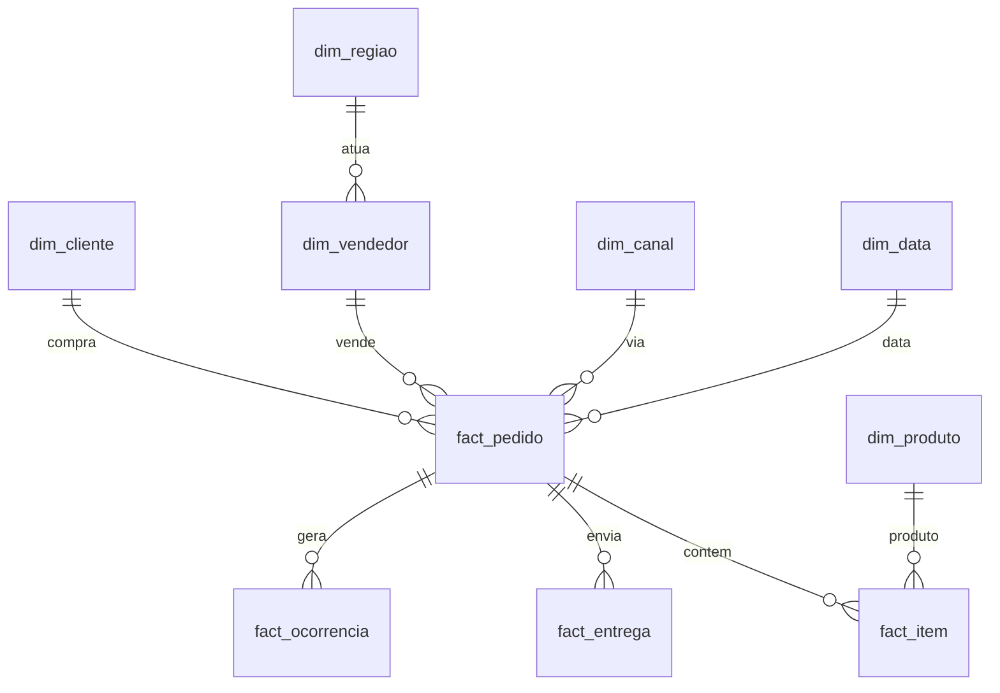

# Arquitetura da Solucao

> Detalhamento tecnico das camadas Bronze, Silver, Gold sobre Databricks Free Edition com Unity Catalog.

---

## Visao geral em camadas

```mermaid
flowchart TB
    subgraph UCVOL["UC Volume: /Volumes/workspace/case_levva/sources/"]
        F1[erp_pedidos_cabecalho_2025.csv]
        F2[erp_pedidos_itens_2025.csv]
        F3[cadastro_produtos_api_dump.json]
        F4[crm_clientes_export.xlsx]
        F5[comercial_canais.xlsx]
        F6[vendedores.csv]
        F7[legado_regioes_pipe.txt]
        F8[atendimento_ocorrencias.ndjson]
        F9[logistica_entregas.json]
    end

    subgraph BRONZE["workspace.case_levva_bronze"]
        B1[bronze.pedidos_cabecalho]
        B2[bronze.pedidos_itens]
        B3[bronze.produtos]
        B4[bronze.clientes]
        B5[bronze.canais]
        B6[bronze.vendedores]
        B7[bronze.regioes]
        B8[bronze.ocorrencias]
        B9[bronze.entregas]
    end

    subgraph SILVER["workspace.case_levva_silver"]
        S1[silver.pedidos_cabecalho]
        S2[silver.pedidos_itens]
        S3[silver.produtos]
        S4[silver.clientes]
        S5[silver.canais]
        S6[silver.vendedores]
        S7[silver.regioes]
        S8[silver.ocorrencias]
        S9[silver.entregas]
    end

    subgraph GOLD["workspace.case_levva_gold - Star Schema"]
        D[Dimensoes<br/>dim_cliente<br/>dim_produto<br/>dim_canal<br/>dim_regiao<br/>dim_vendedor<br/>dim_data]
        FA[Fatos<br/>fact_pedido<br/>fact_item<br/>fact_entrega<br/>fact_ocorrencia]
        VW[vw_kpi_business]
    end

    UCVOL -->|01_bronze_ingest| BRONZE
    BRONZE -->|02_silver_*| SILVER
    SILVER -->|03_gold_dimensions| D
    SILVER -->|04_gold_facts| FA
    D --> FA
    D --> VW
    FA --> VW
```



---

## Camada Bronze - Raw + Metadata

### Principios

1. **Preservar o dado bruto** exatamente como veio da fonte
2. **Nao tratar, nao inferir tipos**: todas as colunas como `string`
3. **Garantir rastreabilidade** com colunas tecnicas

### Colunas tecnicas adicionadas em todas as tabelas Bronze

| Coluna | Tipo | Funcao |
|---|---|---|
| `_source_file` | string | Caminho original do arquivo no Volume |
| `_ingestion_timestamp` | timestamp | Momento exato da ingestao (server-side) |
| `_record_id` | bigint | Row number monotonico para tracing |

### Estrategia de ingestao por formato

| Formato | Reader PySpark | Observacoes |
|---|---|---|
| CSV `;` | `spark.read.option("sep", ";").option("header", true).csv()` | Pedidos cabecalho + vendedores |
| CSV `,` | `spark.read.option("header", true).csv()` | Pedidos itens |
| JSON aninhado | `spark.read.option("multiline", true).json()` | Produtos + entregas (preserva nested como JSON string no Bronze) |
| NDJSON | `spark.read.json()` (1 obj por linha) | Ocorrencias |
| Pipe TXT | `spark.read.option("sep", "\|").csv()` | Regioes |
| XLSX | `pandas.read_excel()` -> `spark.createDataFrame()` | Clientes + canais (Excel nao nativo no Spark) |

### Modo de escrita

```python
.write.format("delta").mode("overwrite").saveAsTable(f"workspace.case_levva_bronze.{table_name}")
```

**Justificativa do `overwrite`:** o case tem volumes pequenos e fontes sao snapshots. Em producao real, seria `append` com particao por data de ingestao.

---

## Camada Silver - Normalizado e validado

### Principios

1. **Type casting com resiliencia** - `try_cast`, `try_to_date`, `try_to_timestamp` via `F.expr` (nao falham, retornam null)
2. **Padronizacao de enums** - UPPER + lookup para corrigir variacoes de caps
3. **Dedup deterministico** - `row_number()` por chave + ordenacao
4. **Parse de estruturas aninhadas** - JSON -> colunas tabulares
5. **Flags de DQ** - registros problematicos marcados, nao descartados

### Padrao de transformacao

```python
silver_df = (
    bronze_df
    .transform(parse_dates)        # multiplos formatos -> date unico
    .transform(normalize_decimals) # BR -> US com try_cast
    .transform(normalize_enums)    # UPPER + mapping
    .transform(parse_nested_json)  # quando aplicavel
    .transform(dedup_by_key)       # row_number window
    .transform(add_dq_flags)       # _dq_status, _dq_reasons
)
```

### Funcao utilitaria - multi-format date parser (Spark 4 ANSI mode)

```python
from pyspark.sql import functions as F

def parse_multi_format_date(col_name):
    """Tenta ISO YYYY-MM-DD, BR DD/MM/YYYY, e BR DD/MM/YYYY HH:MM nessa ordem.
    Usa F.expr para acessar try_to_date/try_to_timestamp via SQL (PySpark Python
    nao expoe diretamente; ANSI mode rejeita to_date direto em parse falho)."""
    return F.coalesce(
        F.expr(f"try_to_date({col_name}, 'yyyy-MM-dd')"),
        F.expr(f"try_to_date({col_name}, 'dd/MM/yyyy')"),
        F.expr(f"try_to_timestamp({col_name}, 'dd/MM/yyyy HH:mm')").cast("date"),
    )
```

### Tratamento de timestamp ISO com `T` literal

Spark DateTimeFormatter requer `'T'` literal escapado com aspas simples no pattern, o que torna a string SQL complexa de escapar dentro de Python f-string. Solucao adotada: substituir o `T` por espaco antes do parse:

```python
F.expr(f"try_to_timestamp(replace({col_name}, 'T', ' '), 'yyyy-MM-dd HH:mm:ss')")
```

### Modo de escrita

```python
.write.format("delta").mode("overwrite").saveAsTable(f"workspace.case_levva_silver.{table_name}")
```

Em producao, evoluiria para `MERGE INTO` baseado em chave de negocio + watermark.

---

## Camada Gold - Star Schema Analitico

### Principios

1. **Separacao clara entre entidades e eventos** - dims vs facts
2. **Granularidade explicita** - documentada em cada tabela
3. **SCD Type 1** - sobrescreve no update (case nao exige historico)
4. **Surrogate keys** - usadas onde a chave natural e instavel; chaves naturais mantidas como atributo
5. **Pre-joins seletivos** em view consolidada para analises rapidas

### Modelo dimensional



### Detalhe de cada tabela

| Tabela | Granularidade | PK |
|---|---|---|
| `dim_cliente` | 1 linha por cliente | `customer_code` |
| `dim_produto` | 1 linha por produto | `product_code` |
| `dim_canal` | 1 linha por canal de venda | `canal_id` |
| `dim_regiao` | 1 linha por regiao canonica | `regional_code` |
| `dim_vendedor` | 1 linha por vendedor | `seller_id` |
| `dim_data` | 1 linha por dia (gerada) | `data_id` (yyyymmdd) |
| `fact_pedido` | 1 linha por pedido (cabecalho) | `order_id` |
| `fact_item` | 1 linha por item de pedido | (`order_id`, `item_seq`) |
| `fact_entrega` | 1 linha por entrega | `delivery_id` |
| `fact_ocorrencia` | 1 linha por ticket | `ticket_id` |

Detalhe completo de colunas em [`data_model.md`](data_model.md).

---

## Convencoes

### Naming

- Tabelas: `<catalog>.<schema>.<entidade>` em snake_case (ex: `workspace.case_levva_bronze.pedidos_cabecalho`)
- Colunas: snake_case sempre (ex: `customer_code`, `gross_amount`)
- Colunas tecnicas: prefixo `_` (ex: `_source_file`, `_dq_status`)
- Metricas em fatos: substantivo descritivo (`net_amount`, nao `valor`)

### Schemas no Unity Catalog

- `workspace.case_levva_bronze` - raw + metadata
- `workspace.case_levva_silver` - normalizado por entidade
- `workspace.case_levva_gold` - star schema analitico

### Storage fisico

Tabelas Delta gerenciadas pelo Unity Catalog (UC managed tables). Storage S3 transparente ao usuario (path interno do metastore Databricks). Volume de sources tambem managed: `/Volumes/workspace/case_levva/sources/`.

---

## Idempotencia

Todos os notebooks podem rodar de novo sem corromper estado:

- Bronze: `mode("overwrite")` substitui completamente
- Silver: `mode("overwrite")` regrava a partir do Bronze atual
- Gold: dimensoes e fatos refeitos a partir do Silver

Em caso de erro parcial (ex: serverless reciclado na metade do Silver), basta re-executar do ponto que falhou ou disparar o DAG completo de novo. Nenhum estado intermediario e perdido.

---

## Orquestracao - Multi-task DAG

O pipeline e executado como um unico job multi-task com dependencias declaradas:

- `bronze_ingest` (root)
- 8 silvers em paralelo (depends_on: bronze_ingest)
- `gold_dimensions` (depends_on: todos os silvers)
- `gold_facts` (depends_on: gold_dimensions)
- `gold_kpis` (depends_on: gold_facts)
- `validation` (depends_on: gold_kpis)

Free Edition tem cota de concorrencia serverless limitada; quando os 8 silvers paralelos estouram, alguns sao serializados pelo scheduler do proprio Databricks - sem perda de correcao, apenas tempo maior.

Submit via CLI:

```bash
databricks jobs submit --json @pipeline_dag.json --profile case-levva
```

---

## Validacao end-to-end

O notebook `99_validation.py` (em `00_setup/`) executa testes de reconciliacao:

1. **Conta de linhas** - Bronze == Silver para entidades sem dedup
2. **Soma de metricas** - `SUM(net_amount)` Bronze == Silver == Gold para pedidos faturados
3. **Cobertura referencial** - todo `customer_code` em fatos existe em `dim_cliente`
4. **Cobertura temporal** - todas as datas em fatos existem em `dim_data`
5. **DQ summary** - quantos registros marcados como `warning` ou `rejected` em cada Silver
6. **Sanity da view** - `vw_kpi_business.count() == fact_pedido.count()`

Saida printada em texto puro com prefixos `[OK]`, `[WARN]`, `[FALHA]` para inspecao rapida.

---

## ANSI mode estrito - tratamentos especificos

O runtime Photon Spark 4.1 do Databricks Free Edition vem com ANSI SQL mode ativado por padrao. Isso afeta varias operacoes que historicamente retornavam NULL silenciosamente:

| Operacao falha | Mitigacao adotada |
|---|---|
| `cast("int")` em string `"5.0"` | `cast("double").cast("int")` |
| `cast("decimal")` em string `"N/A"` | `F.expr("try_cast(... as decimal(15,2))")` |
| `to_date(col, "yyyy-MM-dd")` em string `"2025/09/08"` | `F.expr("try_to_date(col, 'yyyy-MM-dd')")` |
| `to_timestamp` com pattern `yyyy-MM-dd'T'HH:mm:ss` (escape de `'T'`) | `replace(col, 'T', ' ')` + parse com `yyyy-MM-dd HH:mm:ss` |

Em qualquer um desses casos, o registro continua na tabela com o campo NULL e o problema visivel em `_dq_reasons`, em vez de quebrar o pipeline inteiro.
