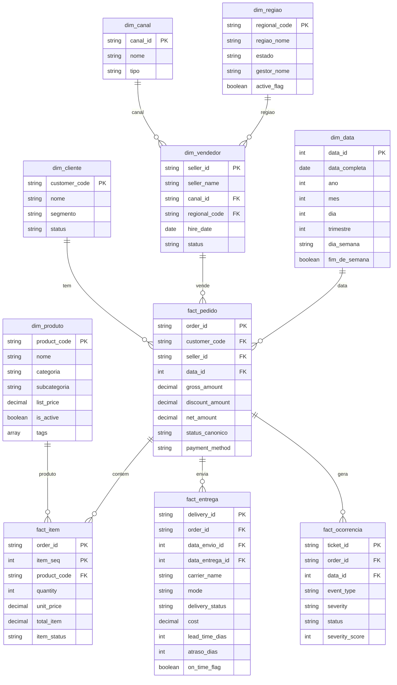

# Modelo de Dados - Star Schema Analítico

> Detalhamento de todas as tabelas Gold: granularidade, colunas, relacionamentos, premissas.

---

## Bus Matrix (Kimball)

Mapping de quais dimensoes (compartilhadas/conformed) sao usadas por quais fatos. `X` indica relacionamento direto; `(via)` indica relacionamento transitivo via outra entidade.

| Dimensao / Fato | fact_pedido | fact_item | fact_entrega | fact_ocorrencia |
|------------------|-------------|-----------|--------------|------------------|
| `dim_cliente` | X | (via fact_pedido) | (via fact_pedido) | (via fact_pedido) |
| `dim_cliente_history` (SCD2) | X (range join) | - | - | - |
| `dim_produto` | - | X | - | - |
| `dim_canal` | X | (via fact_pedido) | - | - |
| `dim_vendedor` | X | - | - | - |
| `dim_regiao` | (via dim_vendedor) | - | (destination_state) | - |
| `dim_data` | X (data_pedido) | - | X (data_envio + data_entrega) | X (created_at) |

**Conformed dimensions:** `dim_cliente`, `dim_canal`, `dim_data` aparecem em multiplos fatos com o mesmo significado, garantindo cross-fact analysis consistente.

**Degenerate dimensions:** `payment_method`, `payment_status` (em `fact_pedido`) e `severity` (em `fact_ocorrencia`) sao atributos textuais mantidos no fato sem dim propria por baixa cardinalidade e uso exclusivo do fato (Kimball pattern).

---

## SCD Type por Dimensao

| Dimensao | Tipo SCD | Justificativa |
|----------|----------|---------------|
| `dim_cliente` | Type 1 (overwrite) | Estado atual; consumido por queries comuns de BI sem necessidade de historico |
| `dim_cliente_history` | **Type 2** (versionado) | Historico de mudancas de segmento/UF/cidade/status (ADR-002). Tabela paralela, nao substitui dim_cliente. Hash MD5 sobre 4 colunas tracking, MERGE pattern |
| `dim_produto` | Type 1 | Catalogo simples; historico nao requerido no escopo do case |
| `dim_canal` | Type 1 | 7 canais estaveis; mudancas raras |
| `dim_vendedor` | Type 1 | Status (ATIVO/INATIVO) muda mas analise atual basta |
| `dim_regiao` | Type 1 | Estatica (5 macro-regioes do Brasil) |
| `dim_data` | Type 1 (geracao deterministica) | Calendario completo regenerado a cada execucao com folga de 30 dias antes/depois do range dos fatos. Inclui feriados BR 2025 + atributos analiticos (semana_iso, eh_dia_util, ultimo_dia_mes) |

---

## Diagrama ER simplificado



---

## Dimensões

### `dim_cliente`

**Granularidade:** 1 linha por cliente único.
**Origem:** `silver.clientes`
**Tipo SCD:** Type 1 (sobrescreve)

| Coluna | Tipo | Descrição |
|---|---|---|
| `customer_code` | string | PK natural |
| `nome` | string | Nome do cliente (sanitizado) |
| `segmento` | string | Segmento de mercado (B2B, B2C, etc.) |
| `status` | string | ATIVO / INATIVO |
| `cidade` | string | Se disponível |
| `estado` | string | Se disponível |
| `_dq_status` | string | Flag de qualidade do registro |

**Premissa:** clientes inativos são mantidos na dimensão para preservar análises históricas.

### `dim_produto`

**Granularidade:** 1 linha por produto.
**Origem:** `silver.produtos` (a partir do JSON aninhado)

| Coluna | Tipo | Descrição |
|---|---|---|
| `product_code` | string | PK natural (era `product.product_id` no JSON) |
| `nome` | string | Nome do produto |
| `categoria` | string | Categoria principal |
| `subcategoria` | string | Subcategoria |
| `list_price` | decimal(15,2) | Preço de tabela |
| `currency` | string | Default BRL |
| `is_active` | boolean | Derivado de `status` |
| `family` | string | De `attributes.family` |
| `tags` | array<string> | De `attributes.tags` |
| `last_updated` | timestamp | De `updated_at` |

**Premissa:** preço de tabela é o `list_price` da fonte; preços efetivos por pedido vêm do `fact_item.unit_price`.

### `dim_canal`

**Granularidade:** 1 linha por canal de vendas.
**Origem:** `silver.canais`

| Coluna | Tipo | Descrição |
|---|---|---|
| `canal_id` | string | PK (CH01-CH07) |
| `nome` | string | Nome do canal |
| `tipo` | string | Categoria (Loja física, E-commerce, etc.) |

**Premissa:** schema final será definido após `00_exploration` confirmar conteúdo do XLSX.

### `dim_regiao`

**Granularidade:** 1 linha por região canônica.
**Origem:** `silver.regioes` (com dedup aplicado)

| Coluna | Tipo | Descrição |
|---|---|---|
| `regional_code` | string | PK normalizado (S, SE, N, NE, CO) |
| `regiao_nome` | string | Norte, Nordeste, etc. |
| `estado` | string | UF representativa |
| `gestor_nome` | string | Manager regional (sanitizado, INITCAP) |
| `active_flag` | boolean | Região ativa |

**Premissa:** após dedup, código `XX` mantido como categoria válida com label "Não informada".

### `dim_vendedor`

**Granularidade:** 1 linha por vendedor (após dedup V004/V008).
**Origem:** `silver.vendedores`

| Coluna | Tipo | Descrição |
|---|---|---|
| `seller_id` | string | PK |
| `seller_name` | string | Nome |
| `canal_id` | string | FK para `dim_canal` |
| `regional_code` | string | FK para `dim_regiao` |
| `hire_date` | date | Data de contratação |
| `status` | string | ATIVO / INATIVO |

### `dim_data`

**Granularidade:** 1 linha por dia.
**Origem:** Gerada via `spark.range()` cobrindo o range completo de datas dos fatos.

| Coluna | Tipo | Descrição |
|---|---|---|
| `data_id` | int | PK no formato YYYYMMDD |
| `data_completa` | date | Data |
| `ano` | int | |
| `mes` | int | |
| `dia` | int | |
| `trimestre` | int | 1-4 |
| `mes_nome` | string | Janeiro, Fevereiro... |
| `dia_semana` | string | Segunda, Terça... |
| `dia_semana_num` | int | 1=Domingo ... 7=Sábado (ISO) |
| `fim_de_semana` | boolean | TRUE se sábado/domingo |
| `ano_mes` | string | Formato YYYY-MM para agrupamento |

**Premissa:** range gerado de min(`order_date`) − 30 dias até max(`order_date`) + 30 dias para cobrir folgas.

---

## Fatos

### `fact_pedido`

**Granularidade:** 1 linha por pedido (cabeçalho).
**Origem:** `silver.pedidos_cabecalho`

| Coluna | Tipo | Descrição |
|---|---|---|
| `order_id` | string | PK |
| `customer_code` | string | FK para `dim_cliente` |
| `seller_id` | string | FK para `dim_vendedor` |
| `data_id` | int | FK para `dim_data` (data do pedido) |
| `data_promessa_id` | int | FK para `dim_data` (data prometida) |
| `gross_amount` | decimal(15,2) | Valor bruto |
| `discount_amount` | decimal(15,2) | Desconto aplicado |
| `net_amount` | decimal(15,2) | Valor líquido (`gross - discount`) |
| `status_canonico` | string | FATURADO, EM_SEPARACAO, CANCELADO, OUTRO |
| `payment_method` | string | Extraído de `payment_details.method` |
| `payment_status` | string | Extraído de `payment_details.status` |

**Métricas calculáveis:**
- `SUM(net_amount)` por dimensão = receita líquida
- `COUNT(*)` por dimensão = quantidade de pedidos
- `AVG(net_amount)` = ticket médio
- `SUM(net_amount) FILTER WHERE status='CANCELADO') / SUM(net_amount)` = taxa cancelamento (em valor)
- `COUNT(*) FILTER WHERE status='CANCELADO') / COUNT(*)` = taxa cancelamento (em pedidos)

### `fact_item`

**Granularidade:** 1 linha por item de pedido.
**Origem:** `silver.pedidos_itens`

| Coluna | Tipo | Descrição |
|---|---|---|
| `order_id` | string | PK composto |
| `item_seq` | int | PK composto |
| `product_code` | string | FK para `dim_produto` |
| `quantity` | int | Quantidade |
| `unit_price` | decimal(15,2) | Preço unitário praticado |
| `total_item` | decimal(15,2) | Total do item (quantity × unit_price) |
| `total_item_calculado` | decimal(15,2) | Recalculado para validação |
| `divergencia_total` | boolean | TRUE se total_item != total_item_calculado |
| `item_status` | string | ENTREGUE, CANCELADO, etc. |

**Métricas:**
- `SUM(quantity)` = volume de itens
- `SUM(total_item)` = receita por item
- Análises de mix de produtos, top sellers

### `fact_entrega`

**Granularidade:** 1 linha por entrega.
**Origem:** `silver.entregas` joinado com `silver.pedidos_cabecalho` para cálculo de atraso.

| Coluna | Tipo | Descrição |
|---|---|---|
| `delivery_id` | string | PK |
| `order_id` | string | FK para `fact_pedido` |
| `data_envio_id` | int | FK para `dim_data` (`shipped_at`) |
| `data_entrega_id` | int | FK para `dim_data` (`delivered_at`) |
| `data_promessa_id` | int | FK para `dim_data` (do pedido) |
| `carrier_name` | string | Transportadora |
| `mode` | string | Modal (Rodoviário, Aéreo, etc.) |
| `delivery_status` | string | ATRASADO, ENTREGUE, EM_TRANSITO |
| `cost` | decimal(15,2) | Custo da entrega |
| `lead_time_dias` | int | `delivered_at - shipped_at` |
| `atraso_dias` | int | `delivered_at - promised_date` (positivo = atraso) |
| `on_time_flag` | boolean | `atraso_dias <= 0` |
| `estado_destino` | string | Para análise geográfica |

**Métricas:**
- `AVG(lead_time_dias)` = tempo médio de entrega
- `SUM(on_time_flag::int) / COUNT(*)` = taxa de pontualidade
- `1 - taxa_pontualidade` = taxa de atraso

### `fact_ocorrencia`

**Granularidade:** 1 linha por ticket.
**Origem:** `silver.ocorrencias`

| Coluna | Tipo | Descrição |
|---|---|---|
| `ticket_id` | string | PK |
| `order_id` | string | FK para `fact_pedido` |
| `data_id` | int | FK para `dim_data` (`created_at`) |
| `event_type` | string | REFUND, TROCA, DELAY, COMPLAINT, NAO_CLASSIFICADO |
| `severity` | string | HIGH, MEDIUM, LOW |
| `severity_score` | int | 3=HIGH, 2=MEDIUM, 1=LOW |
| `status` | string | OPEN, CLOSED |

**Métricas:**
- `COUNT(*)` por tipo de evento = volume de ocorrências
- `SUM(severity_score)` = índice de severidade agregado
- Cruzamento com `fact_pedido` para análise de pedidos com ocorrências

---

## View consolidada - `vw_kpi_business`

**Propósito:** pré-join entre fatos × dimensões para que o Analista de BI faça queries rápidas sem precisar fazer joins manualmente.

**Granularidade:** 1 linha por pedido (mesma de `fact_pedido`), enriquecida com atributos de todas as dimensões + flags derivadas.

```sql
CREATE OR REPLACE VIEW gold.vw_kpi_business AS
SELECT
    -- Identificadores
    p.order_id,
    p.customer_code,
    p.seller_id,

    -- Tempo
    d.data_completa AS data_pedido,
    d.ano,
    d.ano_mes,
    d.trimestre,
    d.dia_semana,

    -- Atributos de cliente
    c.nome AS cliente_nome,
    c.segmento AS cliente_segmento,

    -- Atributos de vendedor / canal / região
    v.seller_name AS vendedor_nome,
    ca.nome AS canal_nome,
    r.regiao_nome,

    -- Métricas do pedido
    p.gross_amount,
    p.discount_amount,
    p.net_amount AS valor_liquido,
    p.status_canonico,

    -- Métricas derivadas (item)
    i.qtd_itens,
    i.qtd_skus_distintos,

    -- Flags operacionais
    (p.status_canonico = 'CANCELADO') AS flag_cancelado,
    COALESCE(e.flag_atrasado, false) AS flag_atrasado,
    COALESCE(o.flag_com_ocorrencia, false) AS flag_com_ocorrencia,
    COALESCE(o.qtd_ocorrencias, 0) AS qtd_ocorrencias,

    -- Métricas de entrega
    e.lead_time_dias,
    e.atraso_dias

FROM gold.fact_pedido p
LEFT JOIN gold.dim_data d ON p.data_id = d.data_id
LEFT JOIN gold.dim_cliente c ON p.customer_code = c.customer_code
LEFT JOIN gold.dim_vendedor v ON p.seller_id = v.seller_id
LEFT JOIN gold.dim_canal ca ON v.canal_id = ca.canal_id
LEFT JOIN gold.dim_regiao r ON v.regional_code = r.regional_code
LEFT JOIN (
    SELECT order_id,
           COUNT(*) AS qtd_itens,
           COUNT(DISTINCT product_code) AS qtd_skus_distintos
    FROM gold.fact_item
    GROUP BY order_id
) i ON p.order_id = i.order_id
LEFT JOIN (
    SELECT order_id,
           MAX(CASE WHEN atraso_dias > 0 THEN true ELSE false END) AS flag_atrasado,
           AVG(lead_time_dias) AS lead_time_dias,
           MAX(atraso_dias) AS atraso_dias
    FROM gold.fact_entrega
    GROUP BY order_id
) e ON p.order_id = e.order_id
LEFT JOIN (
    SELECT order_id,
           true AS flag_com_ocorrencia,
           COUNT(*) AS qtd_ocorrencias
    FROM gold.fact_ocorrencia
    GROUP BY order_id
) o ON p.order_id = o.order_id;
```

---

## Premissas de modelagem

1. **Dimensões como SCD Type 1** - sobrescreve no update; não preserva histórico de mudanças de atributos. Justificativa: case não exige análise temporal de mudanças cadastrais.
2. **Surrogate keys ausentes** - chaves naturais foram suficientes (estáveis nas fontes). Em produção real com SCD Type 2, surrogate keys seriam necessárias.
3. **`dim_data` gerada** - não derivada de uma fonte, garante cobertura temporal completa.
4. **Fatos não-aditivos não foram criados** - o case não pediu, manteve simples.
5. **`fact_entrega` joinado com pedidos no Silver** - para já trazer `promised_date` e calcular atraso uma vez só.
6. **`vw_kpi_business` granular pedido** - granularidade mais comum para dashboards executivos. Para análise por item, usa `fact_item` direto.

---

## O que foi deixado de fora (intencionalmente)

- **`fact_pagamento`** - payment_details tem dados ricos mas case não pediu análises financeiras detalhadas
- **Surrogate keys** - não necessárias para SCD Type 1
- **Tabela bridge para `tags` de produto** - uso direto do array; bridge só se BI precisar de filtros multi-tag
- **Snapshots agregados (snapshot fact)** - case prefere granularidade detalhada
- **Junk dimension** - não há flags suficientes para justificar
